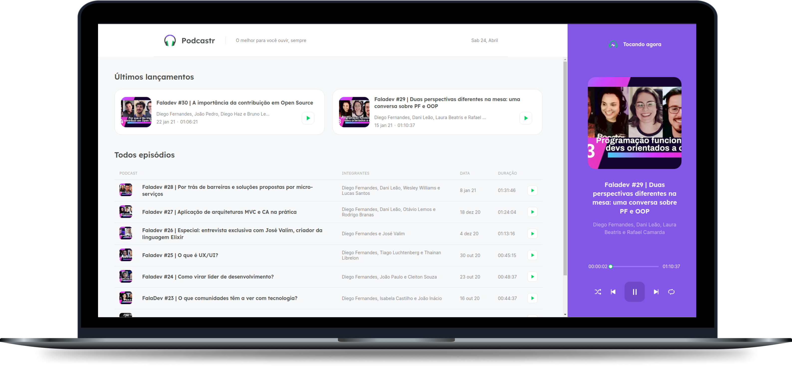

<h1 align="center">
    
</h1>

<br>

<h1 <h1 align="center">
  
</h1>

## 🧪 Technologies

This project was developed using the following technologies:

- [React](https://reactjs.org)
- [NextJS](https://nextjs.org/)
- [TypeScript](https://www.typescriptlang.org/)
- [JSON Server](https://github.com/typicode/json-server)

## 🚀 Getting started

Clone the project and access the folder

```bash
$ git clone https://github.com/brunagoncalves/podcastr-nextjs.git && cd podcastr-nextjs
```

Follow the steps below
```bash
# Install the dependencies
$ yarn

# Start JSON Server
$ yarn server

# Start the project
$ yarn dev
```


## 📝 License

This project is licensed under the MIT License. See the [LICENSE](LICENSE.md) file for details.


---

<p align="center">Made with 💜 by Bruna Goncalves</p>
